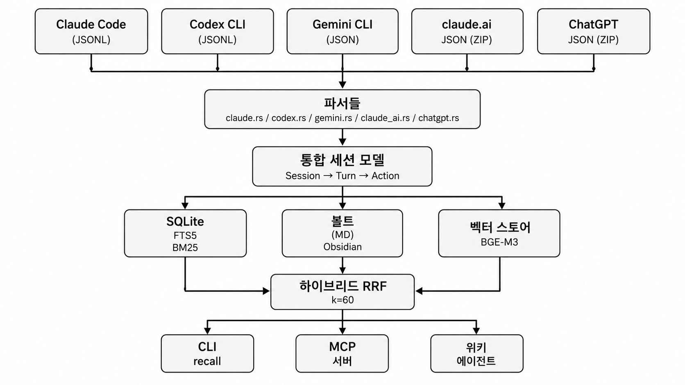

<!-- Thanks to: @batmania52, @yeonsh, @missflash, @CoLuthien, @dev-minsoo -->

<div align="center">

# seCall

将你与 AI 代理的对话整理为本地 wiki 并随时检索。

**Your AI agent conversations, as a searchable local wiki.**

[](https://www.rust-lang.org/)
[](https://www.sqlite.org/)
[](https://modelcontextprotocol.io/)
[](LICENSE)
[](https://onnxruntime.ai/)
[](https://obsidian.md/)

<br/>

[**`한국어`**](README.md) · [**`English`**](README.en.md) · [**`日本語`**](README.ja.md) · **`中文`**

</div>

---

## 目录

- [什么是 seCall？](#什么是-secall)
- [主要功能](#主要功能)
  - [多代理收集](#多代理收集)
  - [混合搜索](#混合搜索)
  - [知识库](#知识库)
  - [Knowledge Graph](#knowledge-graph)
  - [Web UI + REST API + Obsidian 插件](#web-ui--rest-api--obsidian-插件)
  - [MCP 服务器](#mcp-服务器)
  - [多设备知识库同步](#多设备知识库同步)
  - [数据完整性](#数据完整性)
- [快速开始](#快速开始)
  - [前置条件](#前置条件)
  - [Step 1. 安装](#step-1-安装)
  - [Step 2. 初始化](#step-2-初始化)
  - [Step 3. 收集会话](#step-3-收集会话)
  - [Step 4. 搜索](#step-4-搜索)
- [使用方法](#使用方法)
  - [会话查询](#会话查询)
  - [生成嵌入](#生成嵌入)
  - [会话分类](#会话分类)
  - [Wiki 生成](#wiki-生成)
  - [工作日记](#工作日记)
  - [Knowledge Graph](#knowledge-graph-1)
- [配置](#配置)
  - [配置键列表](#配置键列表)
- [CLI 参考](#cli-参考)
- [MCP 集成](#mcp-集成)
- [架构](#架构)
- [技术栈](#技术栈)
- [出处](#出处)
- [许可证](#许可证)

---

<div align="center">

<br/><br/>
</div>

## 什么是 seCall？

seCall 是一款面向 AI 代理对话的本地优先（local-first）工具。它收集 **Claude Code**、**Codex CLI**、**Gemini CLI**、**claude.ai**、**ChatGPT** 的会话日志，借助 LLM 整理出 Obsidian 兼容的 **wiki**，并通过 CLI / MCP 服务器 / REST API / 内置 Web UI 提供 BM25 + 向量混合**搜索**。

### 为什么需要它？

- 架构决策、调试痕迹、设计备忘散落在各个代理的 JSONL 文件里，"上次那个 upstream 报错到底是怎么打的补丁？" 之类的问题每次都要重新翻找,十分麻烦。
- seCall 在保留原始 transcript 的同时,叠加一层由 LLM 整理的 wiki,两者一起索引 — 无论你在 CLI、Web UI、Obsidian 还是 MCP 兼容的 AI 代理里,都能搜到。

## 主要功能

### 多代理收集

将多个 AI 编码代理的会话解析并规范化为统一格式:

| 代理 | 格式 | 状态 |
|---|---|---|
| Claude Code | JSONL | ✅ 稳定 |
| Codex CLI | JSONL | ✅ 稳定 |
| Gemini CLI | JSON | ✅ 稳定 |
| claude.ai | JSON (ZIP) | ✅ v0.2 新增 |
| ChatGPT | JSON (ZIP) | ✅ v0.2.3 新增 |

### 混合搜索

- **BM25 全文搜索**: SQLite FTS5 + 韩语形态素分析（[Lindera](https://github.com/lindera/lindera) ko-dic / [Kiwi-rs](https://github.com/bab2min/kiwi) 可选）
- **向量语义搜索**: [Ollama](https://ollama.com/) BGE-M3 嵌入（1024 维）+ **HNSW ANN 索引**（[usearch](https://github.com/unum-cloud/usearch)），实现 O(log n) 检索
- **Reciprocal Rank Fusion (RRF)**: BM25/向量独立执行后融合（k=60）+ **强制会话多样性**（每个会话最多 2 个 turn）
- **LLM 查询扩展**: 通过 Claude Code 进行自然语言查询扩展

### 知识库

Obsidian 兼容的 Markdown 知识库（双层结构）:

```
vault/
├── raw/.sessions/   # 不可变会话原始数据（dot-prefix → obsidian 自动隐藏，v0.5.0+）
│   └── YYYY-MM-DD/  # 按日期整理
├── wiki/            # AI 生成的知识页面
│   ├── projects/    # 项目摘要
│   ├── topics/      # 技术主题页
│   └── decisions/   # 架构决策记录
└── graph/           # Knowledge Graph 输出
    └── graph.json   # 节点/边数据
```

- **Wiki 生成**: 基于可插拔 LLM backend (`secall wiki update --backend claude|codex|haiku|ollama|lmstudio`)
- 通过 **Obsidian 反向链接**（`[[]]`）连接会话 ↔ wiki 页面
- 为 Dataview 查询提供 frontmatter 元数据（`summary` 字段可即时把握会话内容）

### Knowledge Graph

提取会话间关系来构建知识图谱:

- **节点类型**: session, project, agent, tool — 从 frontmatter 自动提取
- **规则边**: `belongs_to`、`by_agent`、`uses_tool`、`same_project`、`same_day`（无需 LLM）
- **语义边**（Gemini/Ollama/LM Studio）: `fixes_bug`、`modifies_file`、`introduces_tech`、`discusses_topic` — LLM 分析会话内容提取
- **增量构建**: 仅添加新会话节点，关系边全量重算以保证准确性
- **MCP 工具**: `graph_query` — AI 代理可探索会话间关系（BFS，最多 3 跳）

### Web UI + REST API + Obsidian 插件

`secall serve` 在同一端口（8080）上同时提供 REST API 和 Web UI，且 Obsidian 插件复用同一套 API。

```bash
# 启动 REST API + Web UI 服务器
secall serve --port 8080
# 浏览器: http://127.0.0.1:8080
```

**端点**:
- 读取 (Phase 0): `/api/recall`、`/api/get`、`/api/status`、`/api/daily`、`/api/graph`、`/api/wiki`（搜索）
- Wiki 正文 (Phase 1): `GET /api/wiki/{project}`
- 会话元数据 (Phase 0): `/api/sessions`、`/api/projects`、`/api/agents`、`PATCH /api/sessions/{id}/{tags,favorite}`
- 会话笔记 (Phase 2): `PATCH /api/sessions/{id}/notes`
- 标签列表 (Phase 3): `GET /api/tags?with_counts={true|false}`
  - `true`（默认）: `{ "tags": [{ "name": "rust", "count": 12 }, ...] }`
  - `false`: `{ "tags": ["rust", "search", ...] }`
- 命令 (Phase 1): `POST /api/commands/{sync,ingest,wiki-update}`
- 图谱重建 (P37): `POST /api/commands/graph-rebuild`
  - body: `{ since?, session?, all?, retry_failed? }`
  - 响应: `{ job_id, status: "started" }`
  - 单队列策略: 若已有其他 mutating job 在运行则返回 `409 Conflict`
- Job 管理 (Phase 1): `GET /api/jobs`、`GET /api/jobs/{id}`、`GET /api/jobs/{id}/stream`（SSE）
- Job 取消 (P36): `POST /api/jobs/{id}/cancel`
  - 200: `{ "cancelled": true, "job_id": "..." }` — 活动 job 成功取消（对已完成/已取消的 job 也返回相同响应，幂等）
  - 404: `{ "error": "job not found or already evicted" }` — 未注册 / 已被 evict

**Web UI** (`web/`, P32 Phase 0 + P33 Phase 1):
- 深色模式优先的现代 UI（Tailwind + shadcn/ui + Pretendard/Geist Sans）
- 双栏布局（左: 搜索/列表，右: 详情）
- 图谱浮层（点击节点 → 加载会话 + 自动折叠浮层）
- 标签 / 收藏编辑
- 侧边栏 **Commands** 菜单 — 触发 Sync / Ingest / Wiki Update（Phase 1）
- 全局进度条 + SSE 进度流 + 完成/失败 toast（Phase 1）

**Obsidian 插件** (`obsidian-secall/`):
- **搜索视图** — 关键词/语义会话搜索
- **日报视图** — 按日期汇总工作、按项目分组会话、生成笔记
- **图谱视图** — 探索节点关系（depth 1-3，关系过滤）
- **会话视图** — 完整 Markdown 渲染
- **状态栏** — 会话数 + 嵌入状态（每 5 分钟刷新）

### MCP 服务器

向 MCP 兼容的 AI 代理暴露会话索引:

```bash
# stdio 模式（Claude Code、Cursor 等）
secall mcp

# HTTP 模式（Web 客户端）
secall mcp --http 127.0.0.1:8080
```

提供工具: `recall`、`get`、`status`、`wiki_search`、`graph_query`

### 多设备知识库同步

通过 Git 在多台设备之间同步知识库:

```bash
# 完整同步: git pull → reindex → ingest → wiki → graph → git push
secall sync

# 仅本地模式（跳过 git，适合 Claude Code hook）
secall sync --local-only
```

- **MD 为原始数据** — DB 只是派生缓存，可用 `secall reindex --from-vault` 完全恢复
- **主机追踪** — 记录每个会话由哪台设备收集（frontmatter `host` 字段）
- **无冲突** — 会话以设备维度唯一，git merge 不会产生冲突

### 数据完整性

通过内置 lint 规则校验索引 ↔ 知识库一致性:

```bash
secall lint
# L001: 缺失的知识库文件
# L002: 孤立的知识库文件
# L003: FTS 索引缺口
```

## 快速开始

### 前置条件

- Rust 1.75+（从源码构建时）
- Claude Code、Codex CLI、Gemini CLI 至少一个
- [Ollama](https://ollama.com/) — 用于向量搜索（可选，无则仅用 BM25）
- **Windows**: MSVC 工具链（Visual Studio Build Tools）

### Step 1. 安装

**一行安装 (推荐)** — 自动下载 release 二进制并放入 PATH:

```bash
# macOS
curl -fsSL https://raw.githubusercontent.com/hang-in/seCall/main/install.sh | sh
```

```powershell
# Windows (PowerShell)
irm https://raw.githubusercontent.com/hang-in/seCall/main/install.ps1 | iex
```

> Linux 暂无 prebuilt 二进制 — 请使用下面的 Cargo 构建。

**手动下载** — 从 [Releases 页面](https://github.com/hang-in/seCall/releases) 下载对应 OS 的文件:
- macOS: `secall-aarch64-apple-darwin.tar.gz` / `secall-x86_64-apple-darwin.tar.gz`
- Windows: `secall-x86_64-pc-windows-msvc.zip`（secall.exe + onnxruntime.dll）

**Cargo (开发者)**:

```bash
# 仅 CLI/MCP/REST API（不含 Web UI）
cargo install --path crates/secall --no-default-features

# 含 Web UI — 需预装 Node 22 + pnpm 9 + just
git clone https://github.com/hang-in/seCall.git && cd seCall
just build         # 构建 web/dist → cargo build --release
cp target/release/secall ~/.local/bin/
```

> `cargo install secall` 不会自动执行 npm 构建。如需 Web UI，请使用 Releases 二进制或上面的手动构建。

**Homebrew** (计划中 — tap 注册进行中):

```bash
brew install hang-in/tap/secall
```

> **Windows 用户**: 核心功能（解析、BM25 搜索、vault、MCP）行为一致。以下功能因 MSVC 不支持而禁用:
> - **HNSW ANN 索引** (`usearch`) — 退化为 BLOB 余弦扫描
> - **Kiwi-rs 形态素分析** — 退化为 Lindera ko-dic

### Step 2. 初始化

```bash
# 交互式引导（推荐）
secall init

# 或直接指定参数
secall init --vault ~/Documents/Obsidian\ Vault/seCall
secall init --git git@github.com:you/obsidian-vault.git
```

无参数运行 `secall init` 会启动交互式向导:
- 知识库路径设置
- Git remote（可选）
- 分词器选择（lindera/kiwi）
- 嵌入后端选择（ollama/none）
- Ollama 安装检查 + 自动 pull `qwen3-embedding:0.6b` 模型

### Step 3. 收集会话

```bash
# 自动检测 Claude Code 会话
secall ingest --auto

# Codex CLI / Gemini CLI
secall ingest ~/.codex/sessions
secall ingest ~/.gemini/sessions

# claude.ai / ChatGPT 导出（ZIP）
secall ingest ~/Downloads/data-export.zip

# 或一条命令全量同步
secall sync
```

### Step 4. 搜索

```bash
# BM25 全文搜索
secall recall "BM25 索引实现"

# 按项目、代理、日期过滤
secall recall "错误处理" --project seCall --agent claude-code --since 2026-04-01

# 向量语义搜索（需要 Ollama）
secall recall "搜索管道如何工作" --vec

# LLM 查询扩展
secall recall "提升搜索准确率" --expand
```

## Web UI

`secall serve` 在同一端口同时提供 REST API 和 Web UI（单一入口）。

```bash
secall serve --port 8080
# 浏览器访问 http://127.0.0.1:8080
```

**Phase 0 功能** (P32, 只读):
- 搜索 / 会话浏览（双栏布局）
- 每日日记 / wiki 页面浏览（全文 — Phase 1 增加 wiki 正文 fetch）
- 图谱探索（侧边栏 Graph 按钮 → 全屏浮层）
- 标签 / 收藏编辑

**Phase 1 功能** (P33, 命令触发):
- 侧边栏 **Commands** 菜单 — Sync / Ingest / Wiki Update 按钮 + 选项对话框
- SSE 进度流 — 按 phase 实时展示
- 全局进度条 — 在任何页面都能跟踪活动任务（sticky top）
- 完成/失败/中断自动 toast 通知
- 显式标注部分成功（例如: "ingest 之前 OK / push 失败"）
- 同一时刻只允许一个 mutating 任务（单队列）
- 关闭标签页后重新打开时自动恢复进行中的任务

**Phase 2 功能** (P34, 浏览增强):
- 语义搜索模式开关（使用 Ollama 时）
- 关键词高亮 — 列表 + Markdown 正文两侧均支持
- 多标签 AND 过滤 + 日期 quick range（今天/本周/本月）
- 键盘快捷键 — `?` 帮助、`j/k` 列表移动、`/` 搜索聚焦、`g d/w/s/c` 路由、`[/]` 会话 prev/next、`f` 收藏、`e` 笔记
- 相关会话面板 — 基于图谱邻接 + 同项目/同标签推荐（会话详情底部）
- 图谱可视化增强 — dagre 自动布局 + 按节点类型着色/图标 + 边标签切换 + 图例
- 会话元 mini-chart — turn role 分布（user/assistant/system）+ tool 使用频次 top 5
- 用户笔记编辑 — 每个会话的 markdown 笔记（autosave 1s，`PATCH /api/sessions/{id}/notes`）

**Phase 3 功能** (P35, 性能 + 准确度):
- `/api/tags` 端点 — 完整暴露所有标签 + 使用频次（移除原本的 100 个会话启发式）
- SessionList 无限滚动 — 基于 IntersectionObserver 自动加载（page_size=100）
- Code-split — 按路由 + vendor（react/query/radix/viz）拆分 chunk，初始进入 JS ≤ 250 kB（gzip）

**Job Cancellation** (P36, 取消正在运行的任务):
- 可安全中断正在运行的 sync / ingest / wiki-update 任务
- 基于 `tokio_util::sync::CancellationToken` — 整合 `JobRegistry` / `JobExecutor` / `BroadcastSink`，并对外暴露 `ProgressSink::is_cancelled()`
- 适配器（sync/ingest/wiki）在安全点轮询 — phase 间、file/session 循环开始处、LLM 调用前
- 保留部分结果 — 例如: ingest 100 件中处理 50 件后取消 → 结果 JSON 中仍记录 `ingested=50`
- 取消时最终 SSE 事件: `Failed { error: "cancelled by user", partial_result: None }`，job 状态强制设为 `Interrupted`
- REST: `POST /api/jobs/{id}/cancel` — 活动 200、idempotent 200、未注册/evict 404
- Web UI: `JobBanner` 与活动 `JobItem` 上的 **取消** 按钮 + `window.confirm` 对话框（`useCancelJob` mutation hook）

**Graph Sync 自动化** (P37, 语义图谱重建):
- 可以对已经 ingest 的会话单独重建语义图谱 — 例如只完成嵌入的会话进行 backfill、更换模型/提示词后批量重处理等
- DB schema v8: 新增 `sessions.semantic_extracted_at` 列跟踪语义提取状态（NULL = 未处理）
- CLI: `secall graph rebuild [--since DATE] [--session ID] [--all] [--retry-failed]`
- REST: `POST /api/commands/graph-rebuild` — 集成 P33 Job 系统 + P36 cancel
- Web UI: Commands 页面第 4 张卡片 "Graph Rebuild" + 选项对话框（since / session / all / retry-failed）
- 优先级: `--session` > `--all` > `--retry-failed` > `--since`（同时指定时按此顺序生效）— CLI / REST / Web UI 行为一致

### 键盘快捷键 (Phase 2)

| 键 | 动作 |
|---|---|
| `?` | 快捷键帮助 |
| `/` | 搜索聚焦 |
| `j` / `k` | 列表下一项/上一项 |
| `[` / `]` | 会话 prev/next |
| `g d` | Daily 页面 |
| `g w` | Wiki 页面 |
| `g s` | Sessions 页面 |
| `g c` | Commands 页面 |
| `g g` | 图谱浮层切换 |
| `f` | 当前会话收藏切换 |
| `e` | 当前会话笔记编辑 |
| `Esc` | 关闭对话框/浮层 |

### 命令使用

在 Web UI 中: 左侧侧边栏 **Commands** 菜单 → 选择命令 + 选项 → 启动。

CLI 也提供同样的命令（Job 系统仅 Web UI 启用）:
```bash
secall sync --local-only --dry-run
secall sync --no-graph         # 关闭 graph 自动增量（sync 默认开启）
secall ingest --auto --auto-graph   # ingest 时开启 graph 自动增量（默认关闭）
secall wiki update --backend claude

# P37 — 重建语义图谱（按 semantic_extracted_at 状态追踪）
secall graph rebuild --retry-failed              # 批量 backfill 未处理（NULL）会话
secall graph rebuild --since 2026-04-01          # 指定日期之后的会话
secall graph rebuild --session abc12345          # 单个会话
secall graph rebuild --all                       # 全部重建（覆盖已有结果）
# 优先级: --session > --all > --retry-failed > --since（同时指定时按此顺序生效）
```

### Job 系统

命令触发（sync/ingest/wiki update）以后台 Job 形式运行:

1. `POST /api/commands/{kind}` → 立即返回 `{ job_id, status: "started" }`（HTTP 202）
2. 进行中状态保存在内存中以支持快速 SSE/轮询（`Arc<RwLock<HashMap>>`）
3. 完成/失败时持久化到 `jobs` 表
4. **单队列**: 同一时刻只允许一个 mutating 任务 — 第二个请求得到 `409 Conflict` + `{"error":"another mutating job is running","current_kind":"sync|ingest|wiki_update"}`
5. **Read 操作**（搜索、会话查询等）并发无限制
6. 服务器重启时, `running`/`started` 状态的 job 会自动更新为 `interrupted`
7. 启动时自动清理 7 天以上的 完成/失败/中断 job
8. **支持取消** (P36) — `POST /api/jobs/{id}/cancel` 取消活动 job（200 idempotent / 404 unknown）。适配器在 phase 间、循环、LLM 调用前的安全点轮询，保留部分结果，job 终态置为 `Interrupted`

#### Phase 拆分 (sync 示例)

```
sync = init → pull → reindex → ingest → wiki_update → graph → push
```

每个 phase 完成时发出 SSE 事件（`type` discriminator: `initial_state`、`phase_start`、`message`、`progress`、`phase_complete`、`done`、`failed`，KeepAlive 15 秒）。push 失败时 ingest 之前的结果都会保留, 并在结果 JSON 中明示:

```json
{
  "pulled": 3,
  "reindexed": 5,
  "ingested": 2,
  "wiki_updated": 1,
  "graph_nodes_added": 12,
  "graph_edges_added": 34,
  "pushed": null,
  "partial_failure": "push: <error>"
}
```

### 开发模式

```bash
just dev    # Vite dev server (5173) + axum (8080) 同时启动
```

`just dev` 启动 Vite 于 5173, 由 axum 在 8080 进行 reverse proxy。
- **访问 8080**: 单端口一站式（HMR 需手动刷新）
- **直接访问 5173**: 启用 HMR，`/api/*` 反代到 8080

### 构建

```bash
just build          # 构建 web/dist + cargo build --release
# 或手动:
cd web && pnpm install && pnpm build && cd ..
cargo build --release
```

### 前置条件（开发时）

- Node 22 + pnpm 9 — `corepack enable` 或 `npm i -g pnpm`
- [just](https://just.systems) — `brew install just`（可选，用于统一命令）

## 使用方法

### 会话查询

```bash
# 查看摘要
secall get <session-id>

# 完整 Markdown
secall get <session-id> --full

# 指定 turn
secall get <session-id>:5
```

### 生成嵌入

使用语义搜索（`--vec`）需要向量索引。若已安装 Ollama, 运行 `secall embed` 或 `secall sync` 时会自动生成嵌入。

```bash
# 只对新增/变更的会话生成嵌入
secall embed

# 全部重新嵌入
secall embed --all

# 性能选项（M1 Max 推荐值）
secall embed --concurrency 4 --batch-size 32
```

> 若要使用 ONNX Runtime, 先 `secall config set embedding.backend ort`, 然后用 `secall model download` 下载模型。

### 会话分类

在 ingest 时按 config 中定义的 regex 规则自动给会话打标签:

```toml
[ingest.classification]
default = "interactive"
skip_embed_types = ["automated"]   # 该类型跳过向量嵌入

[[ingest.classification.rules]]
pattern = "^\\[当月 rawdata\\]"
session_type = "automated"

[[ingest.classification.rules]]
pattern = "^# Wiki Incremental Update Prompt"
session_type = "automated"
```

- **收集时自动分类** — 按 rules 顺序匹配第一个 user turn 内容（命中第一条即应用）
- **可选跳过嵌入** — `skip_embed_types` 中列出的类型跳过向量嵌入以节省成本
- **搜索过滤** — `recall` 与 MCP `recall` 工具默认排除 `automated` 会话（可用 `--include-automated` 加入）
- **回溯分类** — 用 `secall classify --dry-run` / `secall classify` 对已有会话批量重新分类

### Wiki 生成

```bash
# 用 Claude Code 更新 wiki（默认）
secall wiki update

# Codex CLI 后端
secall wiki update --backend codex

# 本地 LLM 后端
secall wiki update --backend ollama
secall wiki update --backend lmstudio

# Anthropic API（haiku — 直接调用 API）
secall wiki update --backend haiku

# 只增量更新指定会话
secall wiki update --backend lmstudio --session <id>

# 离线 / 手动 sync 模式
secall wiki update --no-pull

# 查看 wiki 状态
secall wiki status
```

### Cross-host 同步（多机 vault）

`secall wiki update` 启动时如检测到 vault 是 git repo, 会自动尝试 `auto_commit + pull --rebase`。

| 场景 | 行为 |
|---|---|
| 同一 topic wiki 在两台机器上都被更新 | 检测到 `wiki/*.md` 冲突后, 基于两侧 `sources` 的并集自动重新生成该页 |
| wiki 之外的文件（`raw/`、`log/`、`graph/` 等）冲突 | 自动中止并提示手动解决 |
| 离线或手动 sync | 用 `secall wiki update --no-pull` 跳过 git 操作 |
| 同一 topic 再次调用 | 不累积旧正文, 用新正文替换, 仅保留 `sources` 的并集 |

后端也可通过 config 配置:

```toml
[wiki]
default_backend = "lmstudio"   # "claude" | "codex" | "haiku" | "ollama" | "lmstudio"

[wiki.backends.lmstudio]
api_url = "http://localhost:1234"
model = "lmstudio-community/gemma-4-e4b-it"
max_tokens = 3000

[wiki.backends.ollama]
api_url = "http://localhost:11434"
model = "gemma3:27b"

[wiki.backends.claude]
model = "sonnet"   # 也可填 "opus"
```

### Wiki review（多后端）

`secall wiki update --review` 可单独选择 review backend。

| Backend | 认证 | JSON 可靠性 | 成本 |
|---|---|---|---|
| `anthropic` | `ANTHROPIC_API_KEY` | 高 | API 计费 |
| `haiku` | `ANTHROPIC_API_KEY` | 高 | API 计费 |
| `claude` | claude CLI | 中 | subscription |
| `codex` | codex CLI | 中 | subscription |
| `ollama` | 无 | 因模型而异 | 本地 |
| `lmstudio` | 无 | 因模型而异 | 本地 |

优先级:
1. CLI `--review-backend`
2. `[wiki].review_backend`
3. `[wiki].default_backend`
4. fallback `"haiku"`

```bash
secall wiki update --review --review-backend ollama
secall config set wiki.review_backend ollama
```

本地后端（`ollama`、`lmstudio`）会自动追加 `docs/prompts/wiki-review-strict-json.md` 中的 strict JSON 后缀并重试。

### 工作日记

按日期自动生成工作日记:

```bash
# 生成今天的日记
secall log

# 指定日期
secall log 2026-04-15
```

- 按项目对会话分组, 从 Knowledge Graph 中提取主题节点
- 用 Ollama/Gemini LLM 整理为散文（未配置 LLM 时使用模板 fallback）
- 结果保存到 `vault/log/{date}.md`

### Knowledge Graph

```bash
# 构建整张图谱
secall graph build

# 查看统计
secall graph stats

# 导出 graph.json
secall graph export
```

## 配置

用 `secall config` 命令管理配置。如需查看相同配置, 也可通过 Web UI `/settings` 或 REST `/api/config`。

```bash
# 查看当前配置
secall config show
secall config llm show

# 修改配置
secall config set output.timezone Asia/Shanghai
secall config set search.tokenizer kiwi
secall config set embedding.backend ollama
secall config llm set log.backend haiku

# 查看配置文件路径
secall config path

# 在 Web UI 中编辑配置（默认 read-only）
secall serve --port 8080 --allow-config-edit
```

### 配置键列表

| 键 | 说明 | 默认值 |
|---|---|---|
| `vault.path` | Obsidian vault 路径 | `~/obsidian-vault/seCall` |
| `vault.git_remote` | Git remote URL | (无) |
| `vault.branch` | Git 分支名 | `main` |
| `search.tokenizer` | 分词器（`lindera` / `kiwi`） | `lindera` |
| `search.default_limit` | 检索结果数 | `10` |
| `embedding.backend` | 嵌入后端（`ollama` / `ort` / `openai` / `openvino` / `ollama_cloud`） | `ollama` |
| `embedding.ollama_model` | Ollama 模型名 | `qwen3-embedding:0.6b` |
| `embedding.pool_size` | ORT session pool 大小（未设置 = 根据 RAM 自动） | `null` |
| `embedding.cloud_host` | Ollama Cloud API host | `https://ollama.com` |
| `embedding.cloud_model` | Ollama Cloud embedding 模型名 | `null` |
| `output.timezone` | 时区（IANA） | `UTC` |
| `ingest.classification.default` | 分类规则未命中时的默认 session_type | `interactive` |
| `ingest.classification.skip_embed_types` | 跳过嵌入的 session_type 列表 | `[]` |
| `graph.semantic_backend` | 语义边提取后端（`ollama_cloud` / `ollama` / `lmstudio` / `anthropic` / `none`） | `none` |
| `graph.cloud_model` | Ollama Cloud 语义模型 | `gemma4:31b-cloud` |
| `graph.cloud_host` | Ollama Cloud API host | `https://ollama.com` |
| `graph.ollama_model` | Ollama/LM Studio 语义模型 | `gemma4:e4b` / `gemma-4-e4b-it` |
| `wiki.default_backend` | wiki 生成后端（`claude` / `codex` / `haiku` / `ollama` / `lmstudio`） | `claude` |
| `wiki.review_backend` | wiki review 后端（`anthropic` / `claude` / `codex` / `haiku` / `ollama` / `lmstudio`） | 回退到 `wiki.default_backend` |
| `wiki.review_model` | wiki review 模型 override | `sonnet` |
| `wiki.backends.<name>.api_url` | 后端 API 端点 | (使用默认) |
| `wiki.backends.<name>.model` | 后端模型名 | (使用默认) |
| `wiki.backends.<name>.max_tokens` | 生成最大 token 数 | `4096` |
| `log.backend` | Daily diary 后端（`claude` / `codex` / `haiku` / `ollama` / `lmstudio`） | 回退到 `graph.semantic_backend` |
| `log.model` | Daily diary 模型 override | backend 默认值 |
| `log.api_url` | Daily diary API URL override | backend 默认值 |
| `log.max_tokens` | Daily diary 最大生成 token 数 | backend 默认值 |

配置文件路径:
- **macOS**: `~/Library/Application Support/secall/config.toml`
- **Linux**: `~/.config/secall/config.toml`
- **Windows**: `%APPDATA%\secall\config.toml`

## CLI 参考

| 命令 | 说明 |
|---|---|
| `secall init` | 交互式引导（vault、分词器、嵌入配置） |
| `secall ingest [path] --auto [--auto-graph]` | 解析并索引代理会话（`--auto-graph` 启用 graph 自动增量，默认关闭） |
| `secall sync [--local-only] [--no-wiki] [--no-semantic] [--no-graph]` | 完整同步: init → pull → reindex → ingest → wiki_update → graph → push（`--no-graph` 跳过 graph 阶段） |
| `secall recall <query>` | 混合搜索（默认排除 automated 会话） |
| `secall recall <query> --include-automated` | 搜索时包含 automated 会话 |
| `secall get <id> [--full]` | 查看会话详情 |
| `secall status` | 索引统计 + 配置摘要 |
| `secall embed [--all]` | 生成向量嵌入 |
| `secall classify [--dry-run]` | 按 config 规则批量重新分类已有会话 |
| `secall lint` | 索引/vault 一致性校验 |
| `secall mcp [--http <addr>]` | 启动 MCP 服务器 |
| `secall config show\|set\|path` | 查看/修改配置 |
| `secall config llm show\|set\|where` | 仅查看/修改 LLM 相关配置 |
| `secall graph build\|stats\|export` | Knowledge Graph 管理 |
| `secall graph rebuild [--since <date>\|--session <id>\|--all\|--retry-failed]` | 重建语义图谱 (P37) — 优先级: `--session` > `--all` > `--retry-failed` > `--since` |
| `secall wiki update [--backend claude\|codex\|haiku\|ollama\|lmstudio] [--review] [--review-backend <name>]` | 生成 wiki + 可选 review |
| `secall wiki status` | 查看 wiki 状态 |
| `secall log [YYYY-MM-DD] [--backend <name>] [--model <name>]` | 生成按日期的工作日记 |
| `secall serve [--port <port>] [--allow-config-edit]` | 启动 REST API + Web UI 服务器（`/settings` 写入需要该 flag） |
| `secall model download\|info\|check` | ONNX 模型管理 |
| `secall reindex --from-vault` | 从 vault 重建 DB |
| `secall migrate summary` | 批量补齐 summary frontmatter |

## MCP 集成

在 Claude Code 配置（`~/.claude/settings.json`）中添加:

```json
{
  "mcpServers": {
    "secall": {
      "command": "secall",
      "args": ["mcp"]
    }
  }
}
```

会话开始/结束时自动同步:

```json
{
  "hooks": {
    "SessionStart": [{
      "matcher": "startup|resume",
      "hooks": [{"type": "command", "command": "secall sync --local-only"}]
    }],
    "SessionEnd": [{
      "hooks": [{"type": "command", "command": "secall sync"}]
    }]
  }
}
```

> 详细配置参考 [GitHub vault 同步指南](docs/reference/github-vault-sync.md)。

## 架构



## 技术栈

| 分类 | 技术 |
|---|---|
| 语言 | Rust 1.75+（2021 edition） |
| 数据库 | SQLite + FTS5 (rusqlite, bundled) |
| 韩语 NLP | Lindera ko-dic + Kiwi-rs 形态素分析 (macOS/Linux) |
| 平台 | macOS、Windows (x86_64)、Linux (CI) |
| 嵌入 | Ollama BGE-M3（1024 维）/ ONNX Runtime（可选） |
| ANN 索引 | usearch HNSW (macOS/Linux) |
| MCP 服务器 | rmcp (stdio + Streamable HTTP / axum) |
| 知识库 | Obsidian 兼容 Markdown |
| REST API | axum（支持 CORS） |
| Wiki 引擎 | Claude Code / Codex CLI / Ollama / LM Studio / Gemini（插件式后端） |
| Obsidian 插件 | obsidian-secall (TypeScript, esbuild) |

## 出处

本项目基于以下想法与项目:

- **[LLM Wiki](https://gist.github.com/karpathy/442a6bf555914893e9891c11519de94f)** (Andrej Karpathy) — 用 LLM 从原始素材逐步构建知识库的模式。seCall 的双层 vault 架构（原始会话 + AI 生成 wiki）正是该理念的直接落地。
- **[nashsu/llm_wiki](https://github.com/nashsu/llm_wiki)** (nashsu) — 同一 LLM Wiki 模式的完整桌面应用实现 (source 追踪、知识图谱、语义搜索、MCP、兼容 Obsidian)。seCall 将该模式专门用于 **AI 智能体会话日志**，作为 CLI/MCP 工具。
- **[qmd](https://github.com/tobi/qmd)** (Tobi Lütke) — 面向 Markdown 文件的本地搜索引擎。seCall 的搜索流水线（FTS5 BM25、向量嵌入、RRF k=60）参考了 qmd 的思路。
- **[graphify](https://github.com/safishamsi/graphify)** (Safi Shamsi) — 将文件夹转换为 knowledge graph 的工具。seCall P16 的确定性图谱抽取与 confidence 标注从该项目获得灵感。

本项目使用 AI 编码代理（Claude Code、Codex）, 通过 [tunaFlow](https://github.com/hang-in/tunaFlow) 多代理工作流平台进行编排开发。

## 许可证

[AGPL-3.0](LICENSE)

## 更新历史

> NOTE: git tag (v0.x.x) 为 SSOT。下表中 P34~P44 是 v0.4.0 release 的内部 phase, P49~P56 是 v0.5.0 release 的 phase。

| 日期 | 版本/Phase | 变更内容 |
|------|------|---------|
| 2026-07-03 | **v0.6.5** | 搜索质量大幅提升 — 外来语 alias + OR/prefix FTS 查询 (#118)、默认嵌入 → `qwen3-embedding:0.6b` (#120)、wiki 语义搜索 config 路径修复 (#121)、zero-turn 会话 healing (#115)、web UI 会话删除 (#108)、死链清理 (Closes #114)。**v0.6.1~v0.6.4 及完整详情: [CHANGELOG.md](CHANGELOG.md)。** |
| 2026-05-15 | **v0.5.0** | 累积 release (P49~P56) — ingest 阶段过滤 TMPDIR/secall-prompt 噪声 (P49) + `raw/sessions/` → `raw/.sessions/` rename（obsidian 自动隐藏, breaking）, `LlmBackend` trait + 4 backend 统一 (P50-B), wiki/ingest 大函数拆解 (P50-C/D/E), graph/log 默认改为 `ollama_cloud` (P51, breaking), wiki 4 backend `generate()` 300s timeout — `kill_on_drop` (P52), wiki `--since` target 显示精确化 (P53), `secall lint --fix-orphan-vault` (P54), `ollama_cloud` wiki review/generation backend (P55), `WikiBackendConfig.cloud_*` 字段 + claude CLI `haiku` alias (P56) |
| 2026-05-10 | P44 (v0.4.0+) | Wiki cross-host merge: `wiki update` 启动时自动 `auto_commit + pull`, `wiki/*.md` 冲突时基于两侧 `sources` 并集自动重新生成, 新增 `--no-pull`, 移除 `merge_with_existing()` 中正文累积逻辑 |
| 2026-05-09 | P43 (v0.4.0+) | 扩展 Wiki review backend: `wiki update --review` 支持 `claude` / `codex` / `haiku` / `ollama` / `lmstudio` / `anthropic` backend, 新增 `[wiki].review_backend` + `--review-backend`, 基于 `toml_edit` 保存 config 时保留用户注释, 新增 `docs/reference/llm-config.md` |
| 2026-05-09 | P41 (v0.4.0+) | LLM 配置统一: `secall log --backend/--model`, 新增 `[log]` 段, hard-coded default model 常量化 + warning, `GET /api/config` / `PATCH /api/config/{section}`, Web `/settings`, `secall config llm show\|set\|where` |
| 2026-05-06 | P40 (v0.4.0) | Wiki 搜索混合模式: `wiki_vectors` 表 (DB v9, page 级嵌入, bge-m3 + Ollama), 基于 SHA-256 content-hash 的幂等索引 + 孤立清理的 `WikiIndexer`, `do_wiki_search` 增加 `mode={keyword\|semantic\|hybrid}` 参数（默认 `keyword` — 兼容）, hybrid 使用 RRF (k=60) 融合, Ollama 不可用 / 嵌入失败时自动 keyword fallback, 新增 CLI `secall wiki vectorize [--force] [--model bge-m3] [--ollama-url ...]` 用于一次性 backfill, 回归测试 `tests/{db_migrations,wiki_indexer,wiki_search_modes}.rs` |
| 2026-05-05 | P39 (v0.4.0) | wiki 流水线 baseline + sync auto-commit 修复 + dotenv autoload: `VaultGit::auto_commit` 改用 `git add -A` 把 SCHEMA.md / graph/ / log/ 等全部 stage（`crates/secall-core/src/vault/git.rs:146`, 8 个回归测试 `tests/vault_auto_commit.rs`）, `secall` 二进制启动时 `dotenvy::dotenv()` autoload（`crates/secall/src/main.rs:382` — 自动注入 Gemini/OpenAI 等 key 环境变量）, 测得 683 会话 sync baseline（`docs/baseline/p39-wiki-baseline.md` / `p39-wiki-quality.md` / `p39-p40-decision.md`）, `graph rebuild --since 2026-05-05` 回填 28 session / 840 edges |
| 2026-05-03 | P38 (v0.4.0) | 补齐测试缺口: `tests/rest_routes.rs`（REST 22 端点路由级回归, 45 tests）+ `tests/session_repo_helpers.rs`（P32~P37 累积 helper 回归, 29 tests）— 合计新增 74 个 P38 测试, 解决 Insight TES-session_repo finding |
| 2026-05-03 | P37 (v0.4.0) | Graph Sync 自动化: DB schema v8（新增 `sessions.semantic_extracted_at` 列追踪语义抽取状态）, `secall graph rebuild [--since\|--session\|--all\|--retry-failed]` CLI（拆出 `extract_one_session_semantic` helper, 优先级: `--session` > `--all` > `--retry-failed` > `--since`）, `POST /api/commands/graph-rebuild` REST（`JobKind::GraphRebuild`, 集成 P33 单队列 + P36 cancel）, web UI Commands 页面第 4 张卡片 "Graph Rebuild" + 选项对话框 |
| 2026-05-02 | P36 (v0.4.0) | Job Cancellation: 集成 `tokio_util::sync::CancellationToken`（`JobRegistry`/`JobExecutor`/`BroadcastSink`）, 新增 `ProgressSink::is_cancelled()`, sync/ingest/wiki 适配器 safe-point 轮询（phase 间·file/session 循环·LLM 调用前）, 保留部分结果, 启用 `POST /api/jobs/{id}/cancel`（200 idempotent / 404 unknown, 最终事件 `Failed { error: "cancelled by user" }` + status=`Interrupted`）, web UI 取消按钮（`JobBanner`/`JobItem`, `useCancelJob` + `window.confirm`） |
| 2026-05-02 | P35 (v0.4.0) | Web UI Phase 3: `/api/tags` 端点（with_counts 选项, 移除 100 会话启发式）, SessionList 无限滚动（IntersectionObserver, page_size=100）, Code-split（vendor react/query/radix/viz + per-route chunk, 初始进入 JS ≤ 250 kB gzip） |
| 2026-05-02 | P34 (v0.4.0) | Web UI Phase 2: 启用语义搜索模式, 关键词高亮, 多标签 + 日期 quick range, 键盘快捷键（`?`/`/`/`j`/`k`/`[`/`]`/`g d/w/s/c/g`/`f`/`e`）, 相关会话面板, 图谱可视化增强（dagre + 节点色彩/图标 + 图例）, 会话元 mini-chart, 用户笔记编辑（`PATCH /api/sessions/{id}/notes`）, DB schema v7 |
| 2026-05-02 | v0.4.0 | Web UI Phase 1 (P33): 命令触发（Sync/Ingest/Wiki Update）, SSE 进度流（按 phase）, Job 系统（单队列 + 7 天 cleanup + interrupted 校正）, 全局进度条 + toast, 图谱自动增量（`secall ingest --auto-graph`, `secall sync --no-graph`）, wiki 正文 GET 端点（`/api/wiki/{project}`）, DB v6（`jobs` 表） |
| 2026-04-17 | v0.3.3 | 新增 LM Studio (OpenAI 兼容) 语义后端（`--backend lmstudio`, #35）, 新增 `secall sync --no-semantic` flag — 防止 GPU 显存竞争 (#34), Gemini Web ZIP ingest 支持 (#31), `graph semantic` CLI 后端配置项 (#30) |
| 2026-04-15 | v0.3.2 | Gemini API 后端（语义图谱 + 日记生成）, Codex wiki 后端 (PR #29), REST API 服务器（`secall serve`）, Obsidian 插件（搜索/日报/图谱视图）, 工作日记（`secall log`）, 语义边（`fixes_bug`、`modifies_file`、`introduces_tech`、`discusses_topic`）, BM25-only 模式时 graph semantic 自动禁用 (#25) |
| 2026-04-12 | v0.3.1 | `secall lint --fix` 清理 stale DB (#15), `wiki_search` created/updated 字段 (#13), P20 测试覆盖率提升 (+16 tests) |
| 2026-04-12 | v0.3.0 | 会话分类（regex 规则、`secall classify`）, Wiki 插件后端（Ollama、LM Studio）, `--include-automated` flag |
| 2026-04-10 | P17 | 交互式引导（`secall init` 向导）, `secall config` CLI, git 分支配置 |
| 2026-04-10 | P16 | Knowledge Graph — 基于 frontmatter 的确定性图谱抽取, `secall graph build/stats/export`, MCP `graph_query`, sync Phase 3.7 |
| 2026-04-09 | P15 | Windows 运行时修复 — Ollama NaN 容忍、跨平台 `command_exists`、sync 冲突预检 |
| 2026-04-09 | P14 | 搜索质量 — 向量独立执行, 会话级结果多样性 |
| 2026-04-09 | P13 | 支持 Windows 构建 — `x86_64-pc-windows-msvc` CI/Release, ORT DLL bundle |
| 2026-04-09 | v0.2.3 | ChatGPT 导出解析器 — `conversations.json`（ZIP）、映射树线性化 |
| 2026-04-08 | v0.2.2 | 时区配置 — 按 IANA 时区换算, 知识库时间戳本地化 |
| 2026-04-08 | v0.2.1 | `--force` 重新收集 + Dataview `::` 转义 + AGPL-3.0 LICENSE |
| 2026-04-07 | P11 | 嵌入性能 — ORT session pool、批量推理、并行化（49h → ~3-4h） |
| 2026-04-07 | P10 | 会话 `summary` frontmatter — 从首个 user turn 自动生成 |
| 2026-04-06 | P8 | 稳定化 + GitHub Actions release 工作流 |
| 2026-04-06 | P7 | `--min-turns`、`embed --all`、`wiki_search` MCP 工具、`--no-wiki` |
| 2026-04-05 | v0.2 | claude.ai 导出解析器、ZIP 自动解压 |
| 2026-04-05 | P6 | ANN 索引（usearch HNSW） |
| 2026-04-04 | P5 | 多设备 vault Git 同步、`secall sync`、`reindex --from-vault` |
| 2026-03-31 | MVP | 首个 release — Claude Code/Codex/Gemini 解析器, BM25+向量搜索, MCP 服务器, Obsidian 知识库 |

---

<div align="center">

**Contact**: [d9ng@outlook.com](mailto:d9ng@outlook.com)

</div>
